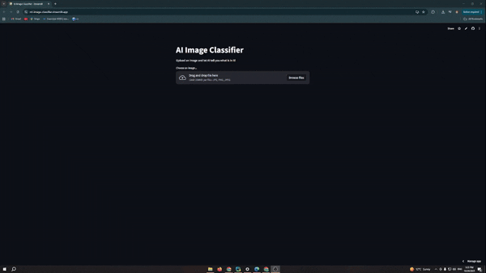

# 🖼️ ML Image Classifier

[](https://www.python.org/)
[](https://streamlit.io/)


A **Streamlit-powered web app** that classifies images using **TensorFlow** and **OpenCV**.  
This project showcases end-to-end machine learning deployment with an interactive web interface.

---

## 🔗 Live Demo

Check out the app live: https://ml-image-classifier.streamlit.app/

---

## 🎬 Demo


---

## 🛠️ Tech Stack

Python 3.13 – Programming language

Streamlit – Web app interface for uploading images and showing results

TensorFlow / Keras – Deep learning, using MobileNetV2 pretrained model

OpenCV (cv2) – Image preprocessing and resizing

NumPy – Array manipulation

Pillow (PIL) – Handling image uploads in the web interface

---

## 📦 Installation

1. Clone the repo:

```bash
git clone https://github.com/Darius-Lr/ml-image-classifier.git
cd ml-image-classifier
